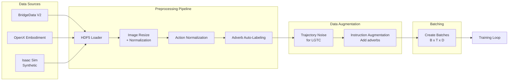
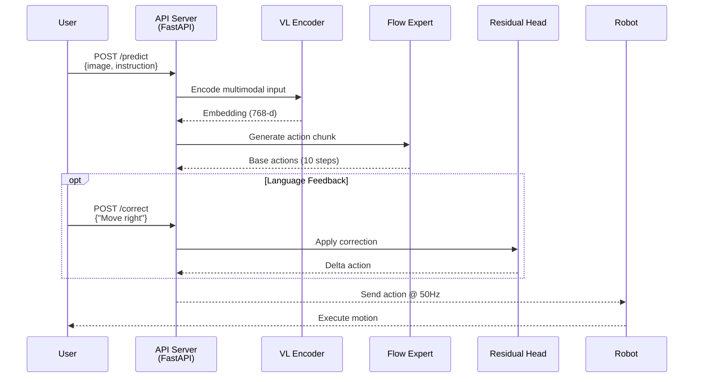

# Motion VLA System Architecture & Data Pipeline

> **작성일**: 2026-01-02  
> **목적**: π0 기반 Motion VLA의 전체 시스템 흐름과 데이터 파이프라인을 시각화하고 명세화

---

## System Overview

### 전체 아키텍처 다이어그램

```mermaid
graph TB
    subgraph Input
        I1[RGB Images<br/>224x224 or 384x384]
        I2[Text Instruction<br/>"Pick up cup carefully"]
        I3[Language Feedback<br/>"Move right" - Optional]
    end
    
    subgraph Stage1[Stage 1: Vision-Language Encoding]
        VL[PaliGemma / OpenVLA<br/>Vision-Language Encoder]
    end
    
    subgraph Stage2[Stage 2: Flow-matching Action Generation]
        FM[Flow-matching Expert<br/>ODE Integration]
        FM --> AC[Action Chunk<br/>shape: B x 10 x 7]
    end
    
    subgraph Stage3[Stage 3: Optional Corrections]
        RC[Residual Correction<br/>LGTC Task]
        SC[Style Controller<br/>ACMC Task]
    end
    
    subgraph Output
        O1[Final Actions<br/>6-DoF + Gripper]
        O2[Velocity/Accel Params<br/>Style-controlled]
    end
    
    I1 --> VL
    I2 --> VL
    VL -->|Embedding<br/>768-d| FM
    AC --> RC
    I3 -.->|If feedback| RC
    RC --> O1
    AC --> SC
    I2 -.->|Adverb extraction| SC
    SC --> O2
```

---

## Data Pipeline

### Training Data Flow



---

## Component Specifications

### 1. Vision-Language Encoder

| 항목 | 명세 |
|:---|:---|
| **Base Model** | PaliGemma-3B-pt-224 또는 OpenVLA-7B |
| **Input** | RGB: (B, 3, 224, 224), Text: (B, seq_len) |
| **Output** | Embedding: (B, 768) or (B, 1024) |
| **Freeze** | Optional - 초기엔 freeze, Fine-tuning 시 LoRA 적용 |

### 2. Flow-matching Action Expert

| 항목 | 명세 |
|:---|:---|
| **Method** | Conditional Flow Matching (CFM) |
| **ODE Solver** | `torchdiffeq.odeint` |
| **Integration Steps** | 10-20 steps (inference time tradeoff) |
| **Output** | Action: (B, action_dim=7) 또는 Chunk: (B, 10, 7) |
| **Frequency** | 50Hz target (20ms per action) |

**수식**:
- Velocity field: $v_\theta(\mathbf{a}_t, t, \mathbf{c})$
- Flow: $\mathbf{a}_1 = \mathbf{a}_0 + \int_0^1 v_\theta(\mathbf{a}_t, t, \mathbf{c}) dt$

### 3. Residual Correction Module (LGTC)

| 항목 | 명세 |
|:---|:---|
| **Trigger** | Real-time language feedback 입력 시 |
| **Input** | Base Action + CLIP/BERT Encoded Feedback |
| **Output** | Delta Action: (B, 7) |
| **Latency** | < 10ms (언어 인코딩 제외) |

### 4. Style Controller (ACMC)

| 항목 | 명세 |
|:---|:---|
| **Input** | Adverb Token (e.g., "carefully") |
| **Processing** | Dictionary lookup → velocity/accel scaling |
| **Output** | Scaled Action + Dynamics Parameters |

---

## Inference Pipeline

### Deployment Architecture



### API Endpoints

#### `/predict` (POST)
```json
{
  "image": "base64_encoded_image",
  "instruction": "Pick up the red cup carefully",
  "adverb": "carefully"  // Optional
}
```

**Response**:
```json
{
  "actions": [[x, y, z, rx, ry, rz, gripper], ...],  // 10-step chunk
  "velocity_scale": 0.5,
  "max_acceleration": 0.3
}
```

#### `/correct` (POST)
```json
{
  "feedback": "Move a bit to the right",
  "current_action": [x, y, z, rx, ry, rz, gripper]
}
```

**Response**:
```json
{
  "delta_action": [dx, dy, dz, drx, dry, drz, dg],
  "corrected_action": [new_x, new_y, ...]
}
```

---

## Training Strategy

### Pre-training Phase
1. **Dataset**: BridgeData V2 (~60K demos) + OpenX subset
2. **Objective**: Flow-matching Loss만 학습
3. **Duration**: ~3-5 days on 8x A100
4. **Checkpoint**: Save best model based on action MSE

### Fine-tuning Phase (Task-specific)

#### LGTC (Trajectory Correction)
1. **Dataset**: Isaac Sim Noisy + Corrected pairs (~10K episodes)
2. **Freeze**: VL Encoder, Flow Expert
3. **Train**: Residual Correction Head만
4. **Loss**: $\mathcal{L} = \|\Delta \mathbf{a}_{pred} - \Delta \mathbf{a}_{gt}\|^2$

#### ACMC (Adverb Control)
1. **Dataset**: BridgeData V2 + Auto-labeled adverbs
2. **Augmentation**: Instruction에 adverb 추가
3. **Loss**: Flow-matching Loss + Velocity consistency
4. **Metric**: Pearson correlation (adverb → actual velocity)

---

## Performance Targets

| Metric | Target | Current (Baseline) |
|:---|:---:|:---:|
| **Inference Latency** | < 20ms per action | TBD |
| **Action Frequency** | 50Hz | TBD |
| **LGTC Success Rate** | > 80% | TBD |
| **ACMC Velocity Accuracy** | Correlation > 0.8 | TBD |
| **Model Size** | < 5GB (FP16) | ~3GB (PaliGemma-3B) |

---

## Directory Structure

```
motion-vla/
├── src/
│   └── motion_vla/
│       ├── models/
│       │   ├── vl_encoder.py          # Stage 1
│       │   ├── flow_action_expert.py  # Stage 2
│       │   ├── residual_head.py       # Stage 3 (LGTC)
│       │   └── style_controller.py    # Stage 3 (ACMC)
│       ├── data/
│       │   ├── hdf5_loader.py
│       │   └── adverb_labeler.py
│       ├── training/
│       │   ├── train_flow.py
│       │   └── train_residual.py
│       └── inference/
│           └── api_server.py
├── scripts/
│   ├── generate_noisy_traj.py
│   └── evaluate_lgtc.py
└── configs/
    ├── paligemma_config.yaml
    └── training_config.yaml
```
