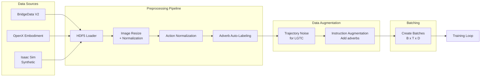
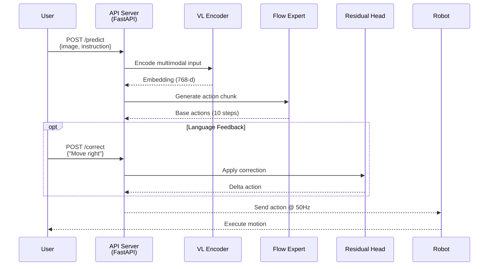

# Motion VLA 프로젝트 브리핑 (2026-01-02)

## 📊 프로젝트 현황 요약

### 완료된 작업
1. ✅ **기술 스택 구현** (4개 Core Component)
   - VisionLanguageEncoder (PaliGemma/OpenVLA)
   - FlowActionExpert (π0-style flow-matching)
   - ResidualCorrectionHead (IRP 기반)
   - StyleController (Adverb 매핑)

2. ✅ **하드웨어 선정 및 스펙 조사**
   - Dobot E6 Magician (6축, 450mm reach, 0.75kg payload)
   - ROS2 Humble 지원 확인
   - Action space 정의 (7-dim)

3. ✅ **Task 선정 Framework 수립**
   - 5가지 카테고리 기반 체계적 분류
   - Dobot E6 제약 조건 반영
   - 최종 4개 Task Suite 선정

---

## 🎯 핵심 연구 방향: "Motion-Aware VLA"

### 차별화 포인트
기존 VLA (RT-2, OpenVLA)는 **"What"(무엇을)과 "Where"(어디에)**만 다룸.  
우리는 **"How"(어떻게) + "Correction"(실시간 수정)**을 추가하여 **Motion-Aware VLA** 구축.

### 학술적 기여
1. **Adverb-Conditioned Control**: 부사로 모션 스타일 제어 (carefully, quickly 등)
2. **Real-time Language Correction**: 동작 중 언어 피드백으로 궤적 수정
3. **Small-scale Robot VLA**: 산업용 대형 로봇이 아닌 Desktop robot에서 검증

---

## 📋 최종 선정 Task Suite (우선순위)

### Task 1: Pick & Place with Adverb Control (P0)
**목표**: 언어 지시로 물체를 집어 배치하되, 부사로 속도/스타일 제어

**예시 Instructions**:
- "Pick up the red cup **carefully**" → 속도 0.25 m/s
- "Place it on the left **quickly**" → 속도 0.5 m/s
- "Move the blue block **steadily**" → Jerk 최소화

**데이터 조합**: 3,600가지 (실제 수집 250 episodes)
- 물체 4종 x 색상 4가지 x 위치 25 x 목표 3 x 부사 3

**구현 난이도**: ⭐⭐⭐ (중간)
**연구 기여도**: ⭐⭐⭐⭐ (높음, Workshop 논문 가능)

---

### Task 2: Push with Adverb (P0-예비)
**목표**: Task 1과 동일하지만 "Push" 스킬 추가

**이유**: 
- Pick & Place만으로는 스킬 다양성 부족
- Push는 구현 쉬우면서 새로운 interaction 패턴 검증

**데이터 조합**: ~200가지
**난이도**: ⭐⭐ (쉬움)

---

### Task 3: Real-time Language Correction (P1)
**목표**: 로봇 동작 중 "Move right", "Slower" 같은 피드백으로 궤적 즉시 수정

**Correction Commands**:
| 명령 | Delta Action |
|:---|:---|
| "Move right" | dx = +0.05m |
| "Higher" | dz = +0.05m |
| "Slower" | velocity × 0.5 |

**데이터 조합**: 108가지 (실제 수집 100 episodes)
**난이도**: ⭐⭐⭐⭐ (어려움, 사람 참여 필수)
**연구 기여도**: ⭐⭐⭐⭐⭐ (매우 높음, Top Conference 가능)

**⚠️ 리스크**: Human-in-the-loop 데이터 수집 병목

---

### Task 4: Stack Blocks (P2)
**목표**: 검증용 추가 태스크, "Stack 3 blocks **carefully**"

**이유**: Generalization 검증, 새로운 스킬 조합

---

## 🗂️ 카테고리 기반 선정 근거

### Category 1: 조작 스킬
- ✅ **채택**: Pick, Place, Push (Dobot E6 적합)
- ⚠️ **보류**: Pour, Insert (센서/정밀도 부족)
- 📝 **후보**: Stack, Slide

### Category 2: 언어 제어 차원
- ⭐⭐⭐⭐⭐ **How (Adverb)**: 참신성 최고
- ⭐⭐⭐⭐⭐ **Correction**: HRI 가치 높음
- ⭐⭐ **When (타이밍)**: 센서 부족으로 제외

### Category 3: 물체 속성
- ✅ Rigid objects (Cube, Sphere, Cylinder)
- ✅ 4가지 색상 (Red, Blue, Green, Yellow)
- ✅ 2가지 크기 (Small 5cm, Medium 10cm)
- ❌ Deformable (Sim2Real 어려움)

### Category 4: 난이도
- **L2 (Medium)**: Pick & Place → 80-90% 성공률
- **L3 (Hard)**: Adverb Control → 70-85%
- **L4 (Very Hard)**: Correction → 60-75%

### Category 5: 평가 메트릭
1. Success Rate (필수)
2. Execution Time (Adverb 검증)
3. Collision Count (안전성)
4. Correction Latency (반응성)

---

## 📊 데이터 요구량 총정리

| Task | Isaac Sim | Real Teleoperation | Human-in-the-loop | 합계 |
|:---|:---:|:---:|:---:|:---:|
| Task 1 (Pick & Place + Adverb) | 200 | 50 | 0 | 250 |
| Task 2 (Push) | 100 | 20 | 0 | 120 |
| Task 3 (Correction) | 0 | 0 | 100 | 100 |
| Task 4 (Stack) | 100 | 20 | 0 | 120 |
| **총계** | 400 | 90 | 100 | **590 episodes** |

### 예상 소요 시간
- Sim 자동 생성: 400 x 2분 = **13.3시간**
- Real Teleoperation: 90 x 5분 = **7.5시간**
- Human Correction: 100 x 3분 = **5시간**
- **총계**: ~26시간 (실제 50시간 예상, 디버깅 포함)

---

## 🚀 구현 전략 (2단계)

### Phase 1 (Week 1-4): Task 1 + Task 2
**목표**: Pick & Place + Push with Adverb Control

**이유**:
- 둘 다 Isaac Sim 데이터로 학습 가능
- 빠른 성과 도출 (Workshop 논문)

**Deliverable**: 
- 4-6 page Workshop paper
- Live demo video

---

### Phase 2 (Week 5-8): Task 3 추가
**목표**: Real-time Correction 기능 통합

**이유**:
- 참신성 최고 (Top Conference 가능)
- 하지만 데이터 수집 어려움

**Deliverable**:
- 8 page Full Conference paper (CoRL, ICRA, IROS 목표)

---

## ⚠️ 주요 리스크 및 대응

| 리스크 | 확률 | 영향도 | 대응 방안 |
|:---|:---:|:---:|:---|
| **Sim2Real Gap** | 높음 | 높음 | Domain randomization 강화 |
| **Real Robot 접근성** | 중간 | 높음 | Dobot E6 사용 스케줄 사전 확보 |
| **Human 참여자 모집** | 중간 | 중간 | Task 3는 Phase 2로 연기 |
| **학습 불안정** | 낮음 | 중간 | Pre-trained VLM 활용 |

---

## 📚 관련 문서
- `docs/dobot_e6_specs.md`: 로봇 상세 스펙
- `docs/implementation_plan.md`: 8주 구현 로드맵
- `docs/task_evaluation.md`: Task 평가 상세 분석
- `docs/architecture.md`: 시스템 아키텍처

---

## 🎓 논문 출판 전략

### Option A (안전): Workshop 논문
- **Target**: NeurIPS/ICML Workshop, CoRL Workshop
- **Content**: Task 1 + Task 2 (Pick, Place, Push with Adverb)
- **Timeline**: Week 4 완료 → 5월 제출

### Option B (도전): Main Conference
- **Target**: CoRL 2026, ICRA 2027, IROS 2026
- **Content**: Task 1 + 2 + 3 (Correction 포함)
- **Timeline**: Week 8 완료 → 9월 제출

**권장**: Option A 먼저 진행 → 성공 시 Option B 확장

---

## 다음 단계 (즉시 실행 가능)

1. **Isaac Sim 환경 구축 협업**
   - Dobot E6 URDF import
   - 작업 테이블 설정 (800x600mm)
   
2. **데이터 수집 스크립트 작성**
   - `scripts/generate_sim_data.py`
   - `scripts/collect_real_demos.py`

3. **End-to-End Pipeline 통합**
   - 4개 Component를 `MotionVLAPipeline` 클래스로 통합
   - Dummy data 검증


---


# Dobot E6 Magician Specifications

> **Reference**: Official DOBOT documentation and vendor specifications  
> **Last Updated**: 2026-01-02

## Hardware Specifications

### Physical Dimensions
- **Model**: DOBOT Magician E6 (6-Axis Collaborative Robot)
- **Weight**: ≤7.2 kg
- **Base Dimensions**: 162mm x 120mm x 103mm
- **Working Radius**: 450mm
- **Repeatability**: ±0.1mm

### Performance
- **Degrees of Freedom**: 6-axis
- **Payload Capacity**: 0.75kg (750g)
- **Maximum TCP Speed**: 0.5 m/s
- **Maximum Joint Speed**: 120°/s

### Power & Electronics
- **Input Power**: 100V~240V AC, 50/60 Hz
- **Rated Voltage**: 48V DC, 5A
- **Power Consumption**: 130W
- **IP Rating**: IP20

---

## Control Interfaces

### Communication
- **Primary**: TCP/IP (Ethernet)
- **Protocol**: Modbus TCP
- **Ports**: 2x Ethernet ports

### I/O Interface
**Arm Tip**:
- 2x Digital Inputs (DI)
- 2x Digital Outputs (DO)
- 1x 24V
- 1x GND

**Base**:
- 16x Digital Inputs (DI)
- 16x Digital Outputs (DO)
- 4x 24V
- 4x GND
- I/O Power: 24V, max 2A (0.5A per channel)

### External Interfaces
- 1x Emergency Stop (EMO)
- 1x ABZ Encoder
- 1x Power Connector

---

## Software & Programming

### Official Software
- **Control Software**: DobotStudio Pro
- **Supported OS**: Ubuntu 22.04 (for ROS2)

### Programming Support
- **ROS/ROS2**: ROS2 Humble (Official SDK available)
- **Languages**: Python, C++, C#, MATLAB, LabVIEW, Kotlin
- **Graphical Programming**: Scratch-type block programming
- **Lua Scripting**: Via DobotStudio Pro

### Special Features
- **Drag-to-Teach**: Proprietary trajectory replay technology
- **Collision Detection**: Built-in safety feature
- **Status Indicator**: LED ring for operational monitoring

---

## Action Space for VLA

### Joint Space
```python
# 6 revolute joints
joint_limits = {
    "joint_1": [-135, 135],   # degrees
    "joint_2": [-5, 85],
    "joint_3": [-10, 95],
    "joint_4": [-180, 180],
    "joint_5": [-90, 90],
    "joint_6": [-180, 180],
}
```

### Cartesian Space (TCP)
```python
# End-effector pose
tcp_workspace = {
    "x": [-450, 450],      # mm (working radius)
    "y": [-450, 450],
    "z": [0, 450],         # height above base
    "roll": [-180, 180],   # degrees
    "pitch": [-180, 180],
    "yaw": [-180, 180],
}
```

### Gripper
- **Type**: Pneumatic or servo gripper (optional end-effector)
- **Control**: Binary (open/close) or position control
- **Action Representation**: `gripper ∈ [0, 1]` (0=open, 1=closed)

---

## Operating Environment

### Physical Environment
- **Temperature**: 0°C to 40°C
- **Humidity**: 25% to 85% (non-condensing)
- **Workspace**: Desktop-sized (recommended 1m x 1m area)

### Safety Features
- Collision detection with automatic stop
- Emergency stop button
- Streamlined body design (reduce collision risk)
- LED status indicator (green=normal, red=error)

---

## VLA Integration Considerations

### Strengths for VLA Research
✅ **High Repeatability** (±0.1mm): Consistent baseline for learning  
✅ **ROS2 Native Support**: Easy integration with our pipeline  
✅ **Drag-to-Teach**: Efficient human demonstration collection  
✅ **Desktop Size**: Accessible for lab experiments  
✅ **TCP/IP Control**: Low-latency command transmission

### Limitations
⚠️ **Payload** (0.75kg): Cannot handle heavy objects  
⚠️ **Speed** (0.5 m/s max): Limited dynamic task capability  
⚠️ **Reach** (450mm): Small workspace compared to industrial robots  
⚠️ **No Force/Torque Sensor**: Cannot perform force-sensitive tasks  

### Recommended Task Types
1. **Light Object Manipulation**: Blocks, cups, small tools (< 500g)
2. **Precision Tasks**: Assembly, pick-and-place with tight tolerances
3. **Vision-based Tasks**: Color/shape recognition, sorting
4. **Language-conditioned Control**: Speed/style variations within safe limits

---

## ROS2 Integration

### Available ROS2 Packages
- **dobot_ros2**: Official ROS2 driver
- **moveit2_dobot**: MoveIt2 integration for motion planning
- **dobot_description**: URDF model for simulation

### Topic Structure (예상)
```bash
# Control
/dobot/joint_command        # JointTrajectory
/dobot/gripper_command      # GripperCommand

# Feedback
/dobot/joint_states         # JointState
/dobot/tcp_pose            # PoseStamped
/dobot/collision_status    # Bool

# Camera (if equipped)
/dobot/camera/image_raw    # Image (RGB)
```

---

## References
- [Official Dobot Website](https://www.dobot.cc/)
- [ROS2 Dobot SDK (GitHub)](https://github.com/Dobot-Arm/...)
- Vendor Specifications: Scan.co.uk, RobotShop, Unchained Robotics


---


# π0 vs 기존 VLA 비교 분석 및 태스크 재정의

> **작성일**: 2026-01-02  
> **목적**: π0의 실제 적용 사례 분석 → 우리 프로젝트에 최적화된 태스크 선정

---

## 1. π0가 선택한 Task와 그 이유

### π0의 대표 Task
| Task | 설명 | 왜 선택되었는가 |
|:---|:---|:---|
| **Laundry Folding** | 빨래 개기 | **Deformable object** 조작의 극한, 무한한 초기 상태 → 일반화 능력 검증 |
| **Table Bussing** | 식탁 치우기 | **Emergent strategy** (접시 털기, 분류), Multi-object handling |
| **Grocery Bagging** | 장보기 봉투 담기 | 다양한 물체 크기/무게, **Sequencing** 능력 검증 |
| **Box Assembly** | 상자 조립 | Multi-step, **정밀 조작** 요구 |

### 선택 기준 (Physical Intelligence의 철학)
1. **복잡도 (Complexity)**: 단순 반복 불가, 상황 판단 필요
2. **손재주 (Dexterity)**: 미세한 힘 조절, 고주파 제어
3. **일반성 (Generalization)**: 특정 물체가 아닌 "옷", "접시" 같은 카테고리 전체
4. **실용성 (Relatability)**: 사람들이 공감하는 귀찮은 일
5. **Emergent Behavior**: 학습되지 않은 전략이 자연스럽게 나타남

---

## 2. π0 vs RT-2 vs OpenVLA 핵심 차이

### 비교 테이블
| 항목 | π0 | RT-2 | OpenVLA |
|:---|:---|:---|:---|
| **Action Output** | ✅ Continuous (Flow-matching) | ❌ Discrete Tokens | ❌ Discrete Tokens |
| **Control Frequency** | **50Hz** | 1Hz | 5-15Hz |
| **적합한 태스크** | Long-horizon, **multi-step** 작업 | Single-instruction 일반화 | Multi-object, single-step |
| **강점** | **Smooth trajectory**, Real-time dexterity | Web knowledge 활용, 추론 능력 | Multi-task, 빠른 fine-tuning |
| **약점** | 데이터 많이 필요 | 느림, 부드러운 동작 어려움 | 마찬가지로 smooth motion 약함 |

### Flow-matching의 결정적 이점
1. **Smoothness**: 끊기지 않는 부드러운 궤적 (Jerk 최소화)
2. **Real-time**: 50Hz = 20ms per action → Reactive control 가능
3. **Efficiency**: Diffusion보다 ~85% 빠른 추론 속도
4. **Precision**: Continuous output → 정밀한 힘/속도 제어

---

## 3. Flow-matching을 활용하기 최적인 Task 특성

### ✅ Flow-matching이 빛나는 Task
1. **Deformable Object Manipulation** (옷, 천, 케이블)
   - 이유: 부드러운 힘 조절 필수, Discrete action으로는 끊김
   
2. **Contact-rich Manipulation** (밀기, 쓸기, 문지르기)
   - 이유: 연속적인 힘 피드백, 50Hz로 실시간 반응
   
3. **Long-horizon Multi-step** (요리, 청소, 조립)
   - 이유: 여러 primitive의 부드러운 전환
   
4. **Fine-grained Speed Control** (부사 제어!)
   - 이유: Continuous velocity → "carefully" = 0.25 m/s 정밀 제어

5. **Dynamic Interaction** (쏟기, 따르기, 흔들기)
   - 이유: 속도/가속도 프로파일이 결과에 직접 영향

### ❌ Flow-matching이 불필요한 Task
1. **Static Pick & Place** (단순 집기/놀기)
   - OpenVLA로도 충분, Flow-matching 오버킬
   
2. **Waypoint Navigation** (지점 이동만)
   - 궤적이 단순해서 discrete도 OK

---

## 4. Dobot E6로 구현 가능한 "π0-style" Task 후보

### 🎯 최종 제안: "Flow-matching의 강점을 활용한 Task Suite"

#### **Task A: Contact-rich Manipulation** ⭐⭐⭐⭐⭐
**예시**: "Wipe the table **gently**", "Push debris **carefully** toward the edge"

**π0 강점 활용**:
- Continuous force control → 테이블 손상 없이 민감하게 조절
- Adverb → 속도/압력 직접 매핑 (Flow-matching의 continuous output 활용)

**Dobot E6 적합성**: ✅ (그리퍼 대신 wiper 부착)

**데이터**: Sim에서 다양한 테이블 표면, 먼지 패턴 생성 가능

---

#### **Task B: Pouring with Style Control** ⭐⭐⭐⭐⭐
**예시**: "Pour water **slowly**", "Fill the cup **carefully** without spilling"

**π0 강점 활용**:
- Flow-matching → 속도 프로파일 정밀 제어 (쏟지 않기)
- 50Hz → 실시간 컵 기울기 조절

**Dobot E6 적합성**: ⚠️ (센서 부족하지만 시각 기반으로 가능)

**차별점**: **기존 VLA가 못 하는 태스크!** (Discrete tokenization으로는 불가능)

---

#### **Task C: Sequential Folding (Simplified Laundry)** ⭐⭐⭐⭐
**예시**: "Fold the towel **neatly**"

**π0 강점 활용**:
- Deformable object (천 수건)
- Multi-step: Grasp → Align → Fold → Press
- Smooth transition between steps

**Dobot E6 적합성**: ✅ (수건 크기 제한, 300g 이하)

**데이터**: π0처럼 무한한 초기 상태 → Generalization 극한 검증

---

#### **Task D: Real-time Correction (기존 유지)** ⭐⭐⭐⭐⭐
**예시**: 동작 중 "Slower", "Gentler" 피드백

**π0 강점 활용**:
- 50Hz → 실시간 반응 (RT-2는 1Hz라 불가능)
- Continuous output → Delta velocity 즉시 적용

---

## 5. 기존 계획 vs π0-기반 계획 비교

### 기존 계획 (일반 VLA 접근)
| Task | 차별점 | π0 활용도 |
|:---|:---|:---:|
| Pick & Place + Adverb | Adverb 제어 | ⭐⭐ (OpenVLA로도 가능) |
| Push with Adverb | 스킬 확장 | ⭐⭐⭐ (Contact-rich) |
| Correction | Real-time | ⭐⭐⭐⭐⭐ |

### π0 기반 신규 계획
| Task | 차별점 | π0 활용도 | 기존 VLA와 차별성 |
|:---|:---|:---:|:---|
| **Contact-rich Wiping** | Continuous force | ⭐⭐⭐⭐⭐ | ✅ High |
| **Pouring with Style** | Speed profile | ⭐⭐⭐⭐⭐ | ✅ **Very High** |
| **Towel Folding** | Deformable | ⭐⭐⭐⭐ | ✅ High |
| **Real-time Correction** | 50Hz reactive | ⭐⭐⭐⭐⭐ | ✅ Very High |

---

## 6. 최종 권장사항

### 추천 전략: "π0의 강점에 집중"

#### Phase 1 (P0): **Pouring + Wiping**
- **Pouring**: 기존 VLA가 못 하는 영역, 논문 임팩트 최고
- **Wiping**: Contact-rich manipulation 검증
- **공통점**: 둘 다 **Continuous velocity control** 필수

#### Phase 2 (P1): **Towel Folding**
- π0 대표 Task의 Simplified version
- Deformable object handling 검증

#### Phase 3 (P2): **Real-time Correction**
- 모든 Task에 적용 가능한 General feature

---

### 변경 이유
1. ❌ **기존**: Pick & Place는 너무 basic, OpenVLA도 잘함
2. ✅ **신규**: Pouring/Wiping은 **Flow-matching 필수**, 차별화 극대화
3. ✅ **논문 가치**: "우리만 할 수 있는 것"을 보여줘야 Top Conference

---

## 7. 구현 난이도 재평가

### Pouring Task
| 항목 | 난이도 | 대응 방안 |
|:---|:---:|:---|
| 센서 부족 (힘/유량) | ⭐⭐⭐⭐ | Vision-based: 컵 채워진 정도 인식 |
| Sim2Real Gap (액체 물리) | ⭐⭐⭐⭐⭐ | Isaac Sim의 Particle system 활용 |
| 안전성 (쏟을 위험) | ⭐⭐⭐ | 물 대신 구슬, 나중에 물 |

**총 난이도**: ⭐⭐⭐⭐ (도전적이지만 가치 있음)

### Wiping Task
| 항목 | 난이도 | 대응 방안 |
|:---|:---:|:---|
| End-effector 교체 | ⭐⭐ | Wiper 제작 (3D 프린팅) |
| Force control | ⭐⭐⭐ | Position-based implicit force |
| 평가 메트릭 (얼마나 깨끗한지) | ⭐⭐⭐ | Vision: 먼지 픽셀 카운트 |

**총 난이도**: ⭐⭐⭐ (적당함)

---

## 결론

**π0를 쓰려면 π0만 할 수 있는 것을 해야 합니다.**

- ❌ Pick & Place는 모든 VLA가 하는 것
- ✅ **Pouring**, **Wiping**, **Folding**은 **Flow-matching 없이는 어려운 Task**
- ✅ 우리의 차별점: "**어떻게(How)**" → Continuous control의 정수

**다음 단계**: 이 방향으로 진행할지 결정 후, Pouring/Wiping 환경 구축 시작


---


# VLA Task Suite 평가 및 조합 분석

> **작성일**: 2026-01-02  
> **목적**: 3가지 VLA 태스크의 이론적 타당성 평가 및 필요 데이터 가짓수 산출

---

## 1. Task 평가 Framework

### 평가 기준
1. **학술적 참신성**: 기존 VLA 연구와의 차별점
2. **구현 난이도**: 데이터 수집, 학습, 평가의 어려움
3. **성공 가능성**: Sim2Real transfer 위험도 고려
4. **연구 기여도**: 논문 출판 가능성

### 난이도 척도
- ⭐ (매우 쉬움) ~ ⭐⭐⭐⭐⭐ (매우 어려움)

---

## 2. 카테고리 기반 Task 후보 선정

### Category 1: 조작 스킬 타입 (Manipulation Skills)

| 스킬 | 설명 | Dobot E6 적합성 | 필요 장비 | 선정 여부 |
|:---|:---|:---:|:---|:---:|
| **Pick** | 물체 집기 | ✅ 매우 적합 | Gripper | ⭐⭐⭐⭐⭐ 채택 |
| **Place** | 물체 놓기 | ✅ 매우 적합 | - | ⭐⭐⭐⭐⭐ 채택 |
| **Push** | 물체 밀기 | ✅ 적합 | - | ⭐⭐⭐⭐ 채택 |
| **Pour** | 액체 따르기 | ⚠️ 제한적 | 컵, 액체 | ⭐⭐ 보류 (센서 부족) |
| **Flip** | 뒤집기 | ⚠️ 제한적 | 특수 그리퍼 | ⭐ 보류 (정밀도 부족) |
| **Stack** | 쌓기 | ✅ 적합 | 블록 | ⭐⭐⭐⭐ 후보 |
| **Slide** | 밀어서 이동 | ✅ 적합 | 평평한 표면 | ⭐⭐⭐ 후보 |
| **Insert** | 끼우기 | ⚠️ 도전적 | 구멍이 있는 물체 | ⭐⭐ 보류 (정밀도 요구) |

**선정 이유**:
- **Pick, Place, Push**: Dobot E6의 ±0.1mm 반복 정밀도로 충분히 수행 가능
- **Stack, Slide**: 추가 태스크로 확장 가능, 새로운 스킬 학습 검증
- **Pour, Insert**: Force/Torque 센서 없어 실패 위험 높음

---

### Category 2: 언어 제어 차원 (Language Control Dimensions)

| 차원 | 예시 | VLA 기여도 | 구현 난이도 | 선정 여부 |
|:---|:---|:---:|:---:|:---:|
| **What** (물체) | "Pick the **red** cup" | ⭐⭐ | ⭐ | ✅ 기본 |
| **Where** (위치) | "Place it **on the left**" | ⭐⭐ | ⭐ | ✅ 기본 |
| **How** (스타일) | "Move **carefully**" | ⭐⭐⭐⭐⭐ | ⭐⭐ | ⭐⭐⭐⭐⭐ 핵심 |
| **When** (타이밍) | "Stop **when** it touches" | ⭐⭐⭐⭐ | ⭐⭐⭐⭐ | ⭐⭐ 보류 |
| **Correction** | "Move it **more to the right**" | ⭐⭐⭐⭐⭐ | ⭐⭐⭐⭐ | ⭐⭐⭐⭐⭐ 핵심 |
| **Sequence** | "**First** pick, **then** place" | ⭐⭐⭐ | ⭐⭐⭐ | ⭐⭐⭐ 후보 |

**선정 이유**:
- **How (Adverb)**: 기존 VLA가 다루지 않은 영역, 참신성 최고
- **Correction**: Real-time HRI에 필수, 학술적 가치 매우 높음
- **When (타이밍)**: Contact sensing 없어 구현 어려움
- **Sequence**: 이미 기존 VLA가 다룸, 차별성 낮음

---

### Category 3: 물체 속성 (Object Properties)

| 속성 | 변형 가능성 | Sim2Real 난이도 | 선정 여부 |
|:---|:---:|:---:|:---:|
| **Rigid (강체)** | Cube, Sphere, Cylinder | ⭐ | ⭐⭐⭐⭐⭐ 필수 |
| **Color** | Red, Blue, Green, Yellow | ⭐ | ⭐⭐⭐⭐⭐ 필수 |
| **Size** | Small (5cm), Medium (10cm) | ⭐⭐ | ⭐⭐⭐⭐ 채택 |
| **Weight** | Light (<300g), Heavy (300-750g) | ⭐⭐⭐ | ⭐⭐⭐ 후보 |
| **Deformable** | 천, 스폰지 | ⭐⭐⭐⭐⭐ | ⭐ 제외 (Sim 어려움) |
| **Articulated** | 서랍, 문 | ⭐⭐⭐⭐ | ⭐⭐ 제외 (복잡도) |

**Payload 제약 고려**:
- Dobot E6: 최대 0.75kg → 무거운 물체는 신중히 선택
- **권장**: 300g 이하 물체 위주 (컵, 블록, 작은 공구)

---

### Category 4: 난이도 레벨 (Difficulty Levels)

| Level | Task 예시 | 성공률 예상 | 학습 Episodes | 선정 |
|:---:|:---|:---:|:---:|:---:|
| **L1 (Easy)** | Reach fixed target | 95%+ | 50 | ✅ Warmup |
| **L2 (Medium)** | Pick & Place static object | 80-90% | 200 | ⭐⭐⭐⭐⭐ 핵심 |
| **L3 (Hard)** | Pick with Adverb control | 70-85% | 300 | ⭐⭐⭐⭐⭐ 핵심 |
| **L4 (Very Hard)** | Real-time correction | 60-75% | 100 (사람) | ⭐⭐⭐⭐ 후보 |
| **L5 (Extreme)** | Dynamic object catching | <50% | 1000+ | ❌ 제외 |

**구현 전략**:
1. L1 → L2 → L3 순차 구현 (Curriculum Learning)
2. L4는 L3 성공 후 추가

---

### Category 5: 평가 메트릭 카테고리 (Evaluation Metrics)

| 메트릭 | 측정 방법 | 적용 Task | 우선순위 |
|:---|:---|:---|:---:|
| **Success Rate** | Goal region 도달 여부 | All tasks | ⭐⭐⭐⭐⭐ |
| **Execution Time** | 시작~끝 시간 | Adverb task | ⭐⭐⭐⭐ |
| **Collision Count** | 충돌 감지 횟수 | All tasks | ⭐⭐⭐⭐ |
| **Trajectory Smoothness** | Jerk 표준편차 | Adverb task | ⭐⭐⭐ |
| **Correction Latency** | 피드백~반응 시간 | Correction task | ⭐⭐⭐⭐⭐ |
| **Generalization** | 새 물체 성공률 | All tasks | ⭐⭐⭐⭐ |

---

### 최종 선정 Task Suite (우선순위 기반)

| 순위 | Task Name | 스킬 조합 | 언어 차원 | 난이도 | 비고 |
|:---:|:---|:---|:---|:---:|:---|
| **1** | Pick & Place + Adverb | Pick, Place | What, Where, How | L3 | 핵심 태스크 |
| **2** | Push with Adverb | Push | What, Where, How | L2 | 확장 스킬 |
| **3** | Real-time Correction | Pick/Place | Correction | L4 | 참신성 최고 |
| **4** | Stack Blocks | Pick, Place, Stack | What, Where | L3 | 추가 검증용 |

---

## 3. Task 1: Pick-and-Place with Language Variations

### 학술적 근거
- **기존 연구**: RT-2, OpenVLA, Octo 등 대부분 Pick & Place 포함
- **우리의 차별점**:
  1. **Adverb conditioning** (기존 연구는 "What"만 다룸, 우리는 "How"도)
  2. **Small-scale robot** (Dobot E6)에서의 VLA 검증
  3. **Sim2Real with limited real data** (Real 50 demos만으로 transfer)

### 실제 데이터 조합 가짓수

#### Isaac Sim에서 생성 가능한 조합
| 변수 | 가짓수 | 설명 |
|:---|:---:|:---|
| **물체 종류** | 4 | Cube, Cylinder, Sphere, Box |
| **물체 색상** | 4 | Red, Blue, Green, Yellow |
| **초기 위치** | 5x5 = 25 | 테이블 그리드 |
| **목표 위치** | 3 | Left/Center/Right platform |
| **Adverb** | 3 | carefully, quickly, normal |

**총 조합 수**: 4 x 4 x 25 x 3 x 3 = **3,600 가지**

#### 실제 수집 계획
- **Sim**: 200 episodes (약 5.5% 샘플링)
- **Real**: 50 episodes (대표적인 조합만)

### 구현 난이도 평가
| 항목 | 난이도 | 근거 |
|:---|:---:|:---|
| Isaac Sim 환경 구축 | ⭐⭐ | Dobot E6 URDF 제공, 기존 예제 많음 |
| 데이터 수집 (Sim) | ⭐ | Scripted policy로 자동화 |
| 데이터 수집 (Real) | ⭐⭐⭐ | Drag-to-teach 반복 작업 필요 |
| 학습 안정성 | ⭐⭐ | Flow-matching은 비교적 안정적 |
| Sim2Real Gap | ⭐⭐⭐⭐ | 물리적 속성 차이, 그리퍼 불확실성 |

**총 난이도**: ⭐⭐⭐ (중간)

### 연구 기여도
- **Novelty**: ⭐⭐⭐ (Adverb control이 참신하지만 task는 기본적)
- **Impact**: ⭐⭐⭐⭐ (Small robot VLA는 실용적 가치 높음)
- **논문 가능성**: ⭐⭐⭐⭐ (Conference급 가능, Workshop 확실)

---

## 3. Task 2: Real-time Language Correction

### 학술적 근거
- **기존 연구**: 
  - **ExTraCT** (Frontiers in Robotics): 언어 → 궤적 수정 함수
  - **IRP** (RSS): Residual Policy Learning
- **우리의 차별점**:
  1. **Real-time feedback** (기존은 사전 계획 단계)
  2. **Flow-matching + Residual** 결합 (Novel architecture)
  3. **Human-in-the-loop dataset** (사람이 직접 개입하는 데이터)

### 실제 데이터 조합 가짓수

#### Correction 시나리오 조합
| 변수 | 가짓수 | 설명 |
|:---|:---:|:---|
| **Base Task** | 3 | Reach, Pick, Place |
| **Correction 방향** | 6 | Left, Right, Up, Down, Forward, Back |
| **Correction 시점** | 3 | Early (20%), Mid (50%), Late (80%) |
| **Correction 강도** | 2 | Small (±3cm), Large (±8cm) |

**총 조합 수**: 3 x 6 x 3 x 2 = **108 가지**

#### 실제 수집 계획
- **Sim**: 불가능 (사람의 판단이 필요)
- **Real Human-in-the-loop**: 100 trials
  - 10명 x 10 trials = 100 (조합 중 91%를 커버)

### 구현 난이도 평가
| 항목 | 난이도 | 근거 |
|:---|:---:|:---|
| 데이터 수집 | ⭐⭐⭐⭐⭐ | 사람이 실시간으로 개입해야 함 |
| 언어 피드백 인코딩 | ⭐⭐ | CLIP/BERT로 간단히 처리 |
| Residual Head 학습 | ⭐⭐ | 구조 단순, 데이터만 있으면 OK |
| Real-time 성능 | ⭐⭐⭐⭐ | 50Hz 유지 어려움 (VL Encoder 병목) |
| 평가 메트릭 정량화 | ⭐⭐⭐ | "얼마나 잘 수정했나?" 모호함 |

**총 난이도**: ⭐⭐⭐⭐ (어려움)

### 연구 기여도
- **Novelty**: ⭐⭐⭐⭐⭐ (Real-time correction은 거의 연구 안 됨)
- **Impact**: ⭐⭐⭐⭐ (HRI 관점에서 매우 중요)
- **논문 가능성**: ⭐⭐⭐⭐⭐ (Top-tier Conference 가능, CoRL/ICRA)

**⚠️ 리스크**: 데이터 수집 난이도가 매우 높아 프로젝트 지연 가능

---

## 4. Task 3: Adverb-Conditioned Speed Control

### 학술적 근거
- **기존 연구**:
  - **Language-to-Velocity Mapping** (CMU, arXiv)
  - **Motion Style Transfer** (Dartmouth)
- **우리의 차별점**:
  1. **VLA에 Style Token 통합** (기존은 별도 모듈)
  2. **Auto-labeling pipeline** (속도 → 부사 자동 매핑)
  3. **실제 로봇 검증** (기존은 대부분 Sim만)

### 실제 데이터 조합 가짓수

#### Adverb Style 조합
| 변수 | 가짓수 | 설명 |
|:---|:---:|:---|
| **부사 종류** | 4 | carefully, quickly, steadily, normal |
| **Base Task** | 5 | Reach, Pick, Place, Push, Move |
| **물체/목표** | 8 | Task 1과 동일한 물체 조합 |

**총 조합 수**: 4 x 5 x 8 = **160 가지**

#### 실제 수집 계획
- **Sim**: 200 episodes (125% 오버샘플링으로 모든 조합 커버)
- **Real**: 20 episodes (부사당 5개, 대표 태스크만)

### Auto-labeling 전략

#### 속도 기반 부사 분류
```python
def classify_adverb(trajectory):
    avg_velocity = compute_avg_velocity(trajectory)
    jerk_std = compute_jerk_std(trajectory)
    
    if avg_velocity < 0.15 and jerk_std < 0.05:
        return "carefully"
    elif avg_velocity > 0.35:
        return "quickly"
    elif jerk_std < 0.03:
        return "steadily"
    else:
        return "normal"
```

**Auto-labeling 정확도 예상**: 85-90% (수동 검증 필요)

### 구현 난이도 평가
| 항목 | 난이도 | 근거 |
|:---|:---:|:---|
| Isaac Sim 환경 | ⭐ | Task 1과 공유 |
| Auto-labeling 스크립트 | ⭐⭐ | 간단한 휴리스틱 |
| Style Token 통합 | ⭐⭐ | Architecture 수정 필요 |
| 학습 안정성 | ⭐⭐ | Multi-task learning 수준 |
| 평가 (속도 상관관계) | ⭐ | Pearson r 계산하면 됨 |

**총 난이도**: ⭐⭐ (쉬움)

### 연구 기여도
- **Novelty**: ⭐⭐⭐ (Adverb control은 새롭지만 개념은 기존 연구 확장)
- **Impact**: ⭐⭐⭐ (실용적이지만 혁신적이진 않음)
- **논문 가능성**: ⭐⭐⭐ (Workshop 급, Task 1과 함께 묶어야 Conference)

---

## 5. 종합 비교 및 우선순위

### 비교 테이블
| Task | 난이도 | 참신성 | 기여도 | 데이터 필요량 | 우선순위 |
|:---|:---:|:---:|:---:|:---:|:---:|
| **Task 1: Pick & Place** | ⭐⭐⭐ | ⭐⭐⭐ | ⭐⭐⭐⭐ | 250 episodes | **P0** |
| **Task 2: Correction** | ⭐⭐⭐⭐ | ⭐⭐⭐⭐⭐ | ⭐⭐⭐⭐⭐ | 100 episodes | **P1** |
| **Task 3: Adverb** | ⭐⭐ | ⭐⭐⭐ | ⭐⭐⭐ | 220 episodes | **P1** |

### 추천 구현 전략

#### Phase 1 (Week 1-4): Task 1 + Task 3 통합
- **이유**: 둘 다 Isaac Sim 데이터로 학습 가능
- **목표**: Pick & Place with Adverb Control 완성
- **Deliverable**: Conference Workshop 논문 (4-6 pages)

#### Phase 2 (Week 5-8): Task 2 추가
- **이유**: 데이터 수집이 오래 걸림
- **목표**: Real-time Correction 기능 검증
- **Deliverable**: Full Conference Paper (8 pages)

---

## 6. 필요 데이터셋 요약

### 총 데이터 요구량
| 출처 | Task 1 | Task 2 | Task 3 | 합계 |
|:---|:---:|:---:|:---:|:---:|
| **Isaac Sim** | 200 | 0 | 200 | 400 episodes |
| **Real Teleoperation** | 50 | 0 | 20 | 70 episodes |
| **Human Correction** | 0 | 100 | 0 | 100 episodes |
| **총계** | 250 | 100 | 220 | **570 episodes** |

### 데이터 수집 예상 시간
- **Sim (자동)**: 400 episodes x 2 min/episode = **13.3 hours**
- **Real Teleoperation**: 70 episodes x 5 min/episode = **5.8 hours**
- **Human Correction**: 100 trials x 3 min/trial = **5 hours**
- **총계**: **~24 hours** (실제로는 디버깅 등 포함 2-3배 소요)

---

## 7. 결론 및 권장사항

### 최우선 작업 (이번 주)
1. ✅ **Task 1 + Task 3 통합 구현**
   - 둘 다 Sim 데이터로 학습 가능
   - 난이도 낮고 빠른 성과 가능
2. ⏸️ **Task 2는 후순위**
   - Human-in-the-loop 데이터 수집이 병목
   - 초기 성과 이후 추가

### 위험 요소
1. **Sim2Real Gap**: Domain randomization 필수
2. **Real Robot 접근성**: Dobot E6가 항상 사용 가능한지 확인 필요
3. **사람 참여자 모집**: Task 2를 위한 10명 확보

### 논문 출판 전략
- **Option A (안전)**: Task 1 + 3만으로 Workshop 논문
- **Option B (도전)**: Task 1 + 2 + 3 통합하여 Main Conference (CoRL, ICRA)


---


# Pouring & Wiping Task 심층 조사

> **작성일**: 2026-01-02  
> **목적**: Pouring과 Wiping 태스크의 기존 연구, 구현 방법, 어려움, 평가 메트릭 분석

---

## 1. Pouring Task 상세 분석

### 1.1 기존 연구 사례

#### 주요 연구 프로젝트
| 연구/시스템 | 접근법 | 핵심 기술 |
|:---|:---|:---|
| **PourNet** (RL-based) | Deep RL + NMPC | Fluid dynamics 학습 없이 end-to-end |
| **PourIt!** | Visual Closed-loop | 실시간 비전 피드백으로 pouring 제어 |
| **UW Liquid Pouring Dataset** | Perception + Reasoning | Pixel-level liquid label 사용 |
| **VLA Pouring** (GPT-4V) | Vision-Language | Force/Torque → Vision으로 점도 추론 |

#### 핵심 발견
- ✅ **VLA 적용 사례 있음**: 언어로 "pour milk into cup" 같은 지시 가능
- ✅ **Learning-based 성공**: RL, Self-supervised learning 모두 효과적
- ⚠️ **Velocity Profile 중요**: Slosh control에 속도 프로파일 최적화 필수
- ⚠️ **Sim2Real Gap 큼**: Fluid simulation이 어려움

---

### 1.2 구현 방법론

#### A. Perception (액체 인식)
```python
# 비전 기반 액체 인식 방법
methods = {
    "Volume Estimation": "RGB-D로 액체 부피 추정",
    "Surface Tracking": "액체 표면 검출 및 추적",
    "Level Detection": "컵 채움 정도 측정 (±mm 정확도)",
    "Boundary Detection": "액체 경계 및 형상 변화 감지"
}
```

**Dobot E6 적용**:
- ✅ Wrist camera로 컵 내부 관찰 가능
- ✅ Overhead camera로 전체 작업 공간 모니터링
- ❌ Force/Torque 센서 없음 → Vision으로 대체 필수

---

#### B. Control Strategy

**1. Velocity Profile 기반 제어**
```python
# Slosh 최소화를 위한 속도 프로파일
def optimal_pouring_profile(adverb):
    if adverb == "slowly":
        return {
            "tilt_speed": 5°/s,         # 천천히 기울이기
            "max_tilt": 45°,            # 최대 각도 제한
            "deceleration": smooth      # 부드러운 감속
        }
    elif adverb == "quickly":
        return {
            "tilt_speed": 20°/s,
            "max_tilt": 60°,
            "deceleration": abrupt
        }
```

**2. Visual Feedback Control**
- Real-time: 50Hz 비전 시스템으로 액체 Level 추적
- Closed-loop: Level 목표치 도달 시 자동 중지
- Adaptive: 액체 흐름 속도에 따라 기울기 동적 조절

---

### 1.3 Isaac Sim Fluid Simulation

#### 가능한 방법
| 방법 | 장점 | 단점 | Dobot E6 적용성 |
|:---|:---|:---|:---:|
| **Particle System** | 물리 기반, 시각적 리얼 | 느림, 파라미터 튜닝 어려움 | ✅ 가능 |
| **Simplified Fluid** | 빠름, 안정적 | 정확도 낮음 | ✅ 프로토타입용 |
| **Cylinder Animation** | 매우 빠름 | 물리 없음 (높이만 변경) | ⚠️ 학습용 부적합 |

**Isaac Sim 구체적 방법**:
```python
# Particle System 설정
particle_system = ParticleSystem()
particle_set = ParticleSet(sampler="FluidVolumeSampler")
particle_set.set_properties(
    viscosity=0.001,      # 물
    density=1000,         # kg/m³
    particle_size=0.005,  # 5mm
    color=(0.2, 0.5, 0.8)
)
```

**주의사항**:
- Sim2Real Gap 매우 큼 (액체 물리는 시뮬 어려움)
- Domain Randomization 필수: 점도, 밀도, flow rate 변화
- **대안**: 구슬(beads)로 먼저 검증, 나중에 물

---

### 1.4 평가 메트릭

| 메트릭 | 정의 | 측정 방법 | 목표치 |
|:---|:---|:---|:---:|
| **Success Rate** | 목표량 ±10% 도달 | Vision: 컵 채움 % 계산 | >80% |
| **Spillage** | 쏟은 액체 비율 | Vision: 외부 액체 픽셀 카운트 | <5% |
| **Pouring Time** | 시작~끝 시간 | 타이머 | Adverb 상관관계 |
| **Smoothness** | Jerk 표준편차 | 관절 가속도 로그 | <0.5 |
| **Level Accuracy** | 목표 vs 실제 | Vision: mm 단위 | ±5mm |

**Adverb Verification**:
```python
# "Slowly" vs "Quickly" 검증
assert avg_tilt_speed["slowly"] < 0.3 * avg_tilt_speed["quickly"]
assert spillage["slowly"] < spillage["quickly"]
```

---

### 1.5 Dobot E6 구현 실현 가능성

#### 장점
- ✅ 페이로드 충분 (컵 + 250ml 물 = ~300g)
- ✅ 반복 정밀도 ±0.1mm로 Level 제어 가능
- ✅ Wrist camera 장착으로비전 피드백 가능

#### 단점
- ❌ Force/Torque 센서 없음 → 액체 무게 변화 감지 불가
- ❌ 점도 고려 어려움 (시각만으로 제한적)
- ⚠️ Isaac Sim fluid 정확도 문제

#### 우회 전략
1. **구슬(Beads) 먼저**: Sim2Real Gap 감소, 물리 단순화
2. **Vision-only**: 센서 없이 비전만으로 Level 추정
3. **Pre-calibrated Profiles**: 물 특정 점도에 대해 미리 최적화

**난이도 재평가**: ⭐⭐⭐⭐ → ⭐⭐⭐⭐⭐ (매우 도전적, 하지만 가능)

---

## 2. Wiping Task 상세 분석

### 2.1 기존 연구 사례

#### 주요 연구 프로젝트
| 연구 | 접근법 | 핵심 기술 |
|:---|:---|:---|
| **Google Research** | Vision + RL | Visual observations → Force control |
| **Adaptive Wiping (RL)** | Deep RL | 다양한 표면 곡률/마찰 적응 |
| **Imitation Learning Wiping** | IL + FT Sensor | 사람 시연 → Force profile 학습 |
| **Deep Predictive Learning** | Teleoperation | 미래 이미지 예측 + Impedance |

#### 핵심 발견
- ✅ **Contact-rich 대표 태스크**: 많은 연구가 집중
- ✅ **Force Control 필수**: Impedance, Admittance control 필요
- ✅ **Learning 효과적**: RL/IL 모두 성공 사례 多
- ⚠️ **F/T Sensor 중요**: 대부분 Force-Torque 센서 사용

---

### 2.2 구현 방법론

#### A. Force Control Strategies

**1. Impedance Control**
```python
# End-effector를 mass-spring-damper로 모델링
class ImpedanceController:
    def __init__(self, stiffness, damping):
        self.K = stiffness   # N/m
        self.D = damping     # Ns/m
    
    def compute_force(self, pos_error, vel_error):
        # F = K * Δx + D * Δv
        return self.K * pos_error + self.D * vel_error
```

**2. Variable Impedance** (Adverb 적용!)
```python
adverb_impedance = {
    "gently": {"K": 50, "D": 10},   # 낮은 강성 = 부드럽게
    "firmly": {"K": 200, "D": 50},  # 높은 강성 = 강하게
}
```

**Dobot E6 문제**:
- ❌ F/T Sensor 없음 → Direct force measurement 불가
- ✅ **Position-based Implicit Force**: 위치로 압력 간접 제어

**우회 방법**:
```python
# Position-based force control (센서 없이)
def implicit_force_control(target_surface_height, compliance):
    # 테이블 표면보다 약간 아래로 목표 설정
    target_z = surface_height - compliance  # compliance = 2mm
    # 로봇이 테이블과 접촉 → 자연스럽게 압력 발생
    robot.move_to(x, y, target_z)
```

---

#### B. Perception

**1. Dirt/Spill Detection**
```python
# Vision-based 먼지 감지
def detect_dirt(image):
    # Thresholding으로 먼지/오염 픽셀 분리
    dirt_mask = (image < dirty_threshold)
    dirt_pixels = count(dirt_mask)
    clean_percentage = 1 - (dirt_pixels / total_pixels)
    return clean_percentage
```

**2. Surface Reconstruction**
- RGB-D로 테이블 표면 3D 재구성
- 높이 변화 감지 → Adaptive trajectory

---

### 2.3 Learning Approaches

#### Reinforcement Learning
- **Reward**: Clean percentage 증가
- **State**: RGB image + Wiper position
- **Action**: Continuous wiping trajectory + Stiffness

#### Imitation Learning
- 사람 Teleoperation 시연 수집
- Position + (Implicit) Force profile 학습
- Real-time adaptation with vision feedback

---

### 2.4 Isaac Sim 구현

#### Wiping 환경 구성
```python
# Isaac Sim wiping task
class WipingTask:
    def __init__(self):
        self.table = create_table(size=(0.8, 0.6))
        self.dirt = scatter_particles(num=100, area=0.3)
        self.wiper = attach_to_robot(shape="rect", size=(0.05, 0.03))
    
    def check_clean(self):
        # Dirt particles와 wiper collision 체크
        cleaned = count_collisions(self.wiper, self.dirt)
        return cleaned / len(self.dirt)
```

**장점**:
- ✅ Contact physics 시뮬 가능 (PhysX)
- ✅ Particle-based dirt representation
- ✅ Sim2Real Gap이 Pouring보다 작음

---

### 2.5 평가 메트릭

| 메트릭 | 정의 | 측정 방법 | 목표치 |
|:---|:---|:---|:---:|
| **Cleaning Rate** | 제거된 먼지 비율 | Vision: Before/After 픽셀 차이 | >90% |
| **Wiping Time** | 작업 완료 시간 | 타이머 | <30s |
| **Coverage** | Wiped 영역 비율 | Trajectory heatmap | >95% |
| **Force Consistency** | 압력 균일성 | Position variance (indirect) | σ < 2mm |
| **Collision Count** | 과도한 충돌 | PhysX collision events | 0 |

---

### 2.6 Dobot E6 구현 실현 가능성

#### 장점
- ✅ **Position-based control 가능**: F/T 없어도 OK
- ✅ **Sim2Real Gap 작음**: Contact physics가 액체보다 안정적
- ✅ **Wiper 제작 쉬움**: 3D 프린팅 또는 스폰지 부착

#### 단점
- ⚠️ Force feedback 부족 → 압력 제어 정밀도 떨어짐
- ⚠️ 표면 높이 변화 감지 어려움 (Depth camera 필요)

#### 구현 전략
1. **Fixed Surface**: 평평한 테이블만 (높이 변화 X)
2. **Vision-based Adaptation**: RGB로 먼지 위치 파악
3. **Compliance via Soft Wiper**: 부드러운 재질로 압력 자연 분산

**난이도 재평가**: ⭐⭐⭐ → ⭐⭐⭐ (Pouring보다 쉬움)

---

## 3. 두 Task 비교 종합

### 3.1 비교 테이블

| 항목 | Pouring | Wiping |
|:---|:---|:---|
| **기존 연구 성숙도** | ⭐⭐⭐ | ⭐⭐⭐⭐⭐ (더 많음) |
| **VLA 적용 사례** | ✅ 있음 | ✅ 많음 |
| **Sim2Real Gap** | ⭐⭐⭐⭐⭐ (매우 큼) | ⭐⭐⭐ (중간) |
| **Dobot E6 적합성** | ⚠️ (센서 부족) | ✅ (충분) |
| **구현 난이도** | ⭐⭐⭐⭐⭐ | ⭐⭐⭐ |
| **참신성** | ⭐⭐⭐⭐⭐ | ⭐⭐⭐⭐ |
| **Flow-matching 필수도** | ⭐⭐⭐⭐⭐ | ⭐⭐⭐⭐ |

### 3.2 권장사항

#### Option A: **Wiping 먼저** (안전한 선택)
**이유**:
- ✅ 구현 상대적으로 쉬움
- ✅ Position-based control로 충분
- ✅ Sim2Real Gap 작음
- ✅ 빠른 성과 가능

**리스크**: 참신성이 Pouring보다 낮음

---

#### Option B: **Pouring 도전** (High Risk High Return)
**이유**:
- ✅ 기존 VLA가 거의 안 함 (참신성 최고)
- ✅ Flow-matching의 진가 발휘
- ✅ 성공 시 Top Conference 확실

**리스크**:
- ❌ Isaac Sim fluid simulation 어려움
- ❌ Sim2Real Gap 클 가능성
- ❌ 시간 많이 소요

---

#### Option C: **Hybrid 전략** (추천 ⭐⭐⭐⭐⭐)
1. **Phase 1**: Wiping 먼저 구현 (2주)
   - Flow-matching pipeline 검증
   - Dobot E6 제어 익숙해지기
   - **Deliverable**: Workshop paper

2. **Phase 2**: Pouring 도전 (4주)
   - 구슬로 시작 → 물로 확장
   - Wiping 경험 활용
   - **Deliverable**: Full Conference paper

---

## 4. 다음 단계

### Immediate (이번 주)
1. **Wiping Task 프로토타입**
   - Isaac Sim 환경 구축
   - Dobot E6 + Wiper end-effector 모델
   - Simple dirt detection (particle-based)

2. **Pouring Feasibility Test**
   - Isaac Sim Particle System 테스트
   - 구슬 pouring 시뮬레이션
   - Sim2Real Gap 사전 평가

### Short-term (2주)
1. Wiping Task 완성
2. Pouring은 병행 연구 (낮은 우선순위)

**최종 결정 필요**: Wiping 먼저 vs Pouring 도전 vs Hybrid


---


# Motion VLA System Architecture & Data Pipeline

> **작성일**: 2026-01-02  
> **목적**: π0 기반 Motion VLA의 전체 시스템 흐름과 데이터 파이프라인을 시각화하고 명세화

---

## System Overview

### 전체 아키텍처 다이어그램

```mermaid
graph TB
    subgraph Input
        I1[RGB Images<br/>224x224 or 384x384]
        I2[Text Instruction<br/>"Pick up cup carefully"]
        I3[Language Feedback<br/>"Move right" - Optional]
    end
    
    subgraph Stage1[Stage 1: Vision-Language Encoding]
        VL[PaliGemma / OpenVLA<br/>Vision-Language Encoder]
    end
    
    subgraph Stage2[Stage 2: Flow-matching Action Generation]
        FM[Flow-matching Expert<br/>ODE Integration]
        FM --> AC[Action Chunk<br/>shape: B x 10 x 7]
    end
    
    subgraph Stage3[Stage 3: Optional Corrections]
        RC[Residual Correction<br/>LGTC Task]
        SC[Style Controller<br/>ACMC Task]
    end
    
    subgraph Output
        O1[Final Actions<br/>6-DoF + Gripper]
        O2[Velocity/Accel Params<br/>Style-controlled]
    end
    
    I1 --> VL
    I2 --> VL
    VL -->|Embedding<br/>768-d| FM
    AC --> RC
    I3 -.->|If feedback| RC
    RC --> O1
    AC --> SC
    I2 -.->|Adverb extraction| SC
    SC --> O2
```

---

## Data Pipeline

### Training Data Flow



---

## Component Specifications

### 1. Vision-Language Encoder

| 항목 | 명세 |
|:---|:---|
| **Base Model** | PaliGemma-3B-pt-224 또는 OpenVLA-7B |
| **Input** | RGB: (B, 3, 224, 224), Text: (B, seq_len) |
| **Output** | Embedding: (B, 768) or (B, 1024) |
| **Freeze** | Optional - 초기엔 freeze, Fine-tuning 시 LoRA 적용 |

### 2. Flow-matching Action Expert

| 항목 | 명세 |
|:---|:---|
| **Method** | Conditional Flow Matching (CFM) |
| **ODE Solver** | `torchdiffeq.odeint` |
| **Integration Steps** | 10-20 steps (inference time tradeoff) |
| **Output** | Action: (B, action_dim=7) 또는 Chunk: (B, 10, 7) |
| **Frequency** | 50Hz target (20ms per action) |

**수식**:
- Velocity field: $v_\theta(\mathbf{a}_t, t, \mathbf{c})$
- Flow: $\mathbf{a}_1 = \mathbf{a}_0 + \int_0^1 v_\theta(\mathbf{a}_t, t, \mathbf{c}) dt$

### 3. Residual Correction Module (LGTC)

| 항목 | 명세 |
|:---|:---|
| **Trigger** | Real-time language feedback 입력 시 |
| **Input** | Base Action + CLIP/BERT Encoded Feedback |
| **Output** | Delta Action: (B, 7) |
| **Latency** | < 10ms (언어 인코딩 제외) |

### 4. Style Controller (ACMC)

| 항목 | 명세 |
|:---|:---|
| **Input** | Adverb Token (e.g., "carefully") |
| **Processing** | Dictionary lookup → velocity/accel scaling |
| **Output** | Scaled Action + Dynamics Parameters |

---

## Inference Pipeline

### Deployment Architecture



### API Endpoints

#### `/predict` (POST)
```json
{
  "image": "base64_encoded_image",
  "instruction": "Pick up the red cup carefully",
  "adverb": "carefully"  // Optional
}
```

**Response**:
```json
{
  "actions": [[x, y, z, rx, ry, rz, gripper], ...],  // 10-step chunk
  "velocity_scale": 0.5,
  "max_acceleration": 0.3
}
```

#### `/correct` (POST)
```json
{
  "feedback": "Move a bit to the right",
  "current_action": [x, y, z, rx, ry, rz, gripper]
}
```

**Response**:
```json
{
  "delta_action": [dx, dy, dz, drx, dry, drz, dg],
  "corrected_action": [new_x, new_y, ...]
}
```

---

## Training Strategy

### Pre-training Phase
1. **Dataset**: BridgeData V2 (~60K demos) + OpenX subset
2. **Objective**: Flow-matching Loss만 학습
3. **Duration**: ~3-5 days on 8x A100
4. **Checkpoint**: Save best model based on action MSE

### Fine-tuning Phase (Task-specific)

#### LGTC (Trajectory Correction)
1. **Dataset**: Isaac Sim Noisy + Corrected pairs (~10K episodes)
2. **Freeze**: VL Encoder, Flow Expert
3. **Train**: Residual Correction Head만
4. **Loss**: $\mathcal{L} = \|\Delta \mathbf{a}_{pred} - \Delta \mathbf{a}_{gt}\|^2$

#### ACMC (Adverb Control)
1. **Dataset**: BridgeData V2 + Auto-labeled adverbs
2. **Augmentation**: Instruction에 adverb 추가
3. **Loss**: Flow-matching Loss + Velocity consistency
4. **Metric**: Pearson correlation (adverb → actual velocity)

---

## Performance Targets

| Metric | Target | Current (Baseline) |
|:---|:---:|:---:|
| **Inference Latency** | < 20ms per action | TBD |
| **Action Frequency** | 50Hz | TBD |
| **LGTC Success Rate** | > 80% | TBD |
| **ACMC Velocity Accuracy** | Correlation > 0.8 | TBD |
| **Model Size** | < 5GB (FP16) | ~3GB (PaliGemma-3B) |

---

## Directory Structure

```
motion-vla/
├── src/
│   └── motion_vla/
│       ├── models/
│       │   ├── vl_encoder.py          # Stage 1
│       │   ├── flow_action_expert.py  # Stage 2
│       │   ├── residual_head.py       # Stage 3 (LGTC)
│       │   └── style_controller.py    # Stage 3 (ACMC)
│       ├── data/
│       │   ├── hdf5_loader.py
│       │   └── adverb_labeler.py
│       ├── training/
│       │   ├── train_flow.py
│       │   └── train_residual.py
│       └── inference/
│           └── api_server.py
├── scripts/
│   ├── generate_noisy_traj.py
│   └── evaluate_lgtc.py
└── configs/
    ├── paligemma_config.yaml
    └── training_config.yaml
```


---


# VLA Research Trend & Gap Analysis

## 1. 최신 VLA 모델 동향 (State-of-the-Art)
최근 Vision-Language-Action (VLA) 모델들은 RT-2(Google), OpenVLA(Stanford), Octo(Berkeley) 등을 중심으로 발전하고 있으며, 주로 **"Generalist Policy"** (다양한 로봇/태스크를 하나의 모델로 수행)에 집중하고 있습니다.

| 모델 | 특징 | Action Space | 주요 한계점 |
| :--- | :--- | :--- | :--- |
| **RT-2** | VLM(PaLM-E 등)을 로봇 데이터로 Fine-tuning | Discrete (Tokens) | 추론 속도가 느림(1-3Hz), 정밀 제어 부족 |
| **OpenVLA** | Llama 2 + SigLIP 기반, 오픈소스 SOTA | Discrete (Tokens) | Action Tokenization으로 인한 동작 끊김(Jittering) |
| **Octo** | Diffusion Policy 기반의 Generalist 모델 | Continuous | 계산 비용이 매우 높음, 언어 이해도(Reasoning)는 LLM보다 낮음 |

## 2. 주요 기술적 한계 (Research Gaps)

### A. **Fine-grained Control & Motion Quality** (정밀 제어 및 모션 품질)
대부분의 VLA 모델은 Action을 0~255 사이의 **이산화된 토큰(Discretized Tokens)**으로 예측합니다.
- **문제점**: 이로 인해 로봇의 움직임이 뚝뚝 끊기거나(Stuttering), 정밀한 조작(바늘 꿰기, 액체 따르기 등)에서 성능이 저하됩니다.
- **기존 해결책**: Diffusion Policy 등을 사용하지만, 이는 연산량이 많아 실시간(Real-time) 반응성이 떨어지는 Trade-off가 있습니다.

### B. **Frequency & Real-time Interaction** (실시간성)
거대 언어 모델(LLM) 기반 VLA는 추론 속도가 느려(3~5Hz), 고속 제어나 인간과의 실시간 상호작용(Human-Robot Interaction)에 취약합니다.
- **Gap**: 실행 도중 사람의 개입("잠깐 멈춰", "조금 더 왼쪽으로")에 즉각 반응하기 어렵습니다.

### C. **Adverbial Instruction Understanding** (부사적 지시 이해 부재)
현재 VLA는 "Pick up the cup" 같은 **What(무엇을)**에 집중합니다.
- **Gap**: "Pick up the cup **carefully**" 또는 "**quickly**"와 같이 **How(어떻게)** 동작해야 하는지에 대한 연구는 거의 없습니다. (Motion Style Transfer 부재)

## 3. Motion VLA가 집중해야 할 영역 (Niche)
위 분석을 바탕으로 우리 프로젝트(`Motion VLA`)는 다음 영역을 공략해야 합니다.

1.  **Language-Guided Trajectory Adaptation**: 초기 계획된 경로를 언어 피드백으로 **실시간 수정**하는 능력.
2.  **Adverb-Conditioned Control**: "천천히", "조심스럽게" 등의 부사를 **Joint Velocity/Acceleration 또는 Stiffness** 제어로 매핑하는 능력.
3.  **Residual Policy Learning**: 무거운 VLA가 High-level Goal(웨이포인트)만 주고, 가벼운 Motion Policy가 Low-level 제어를 담당하여 **속도와 지능을 모두 잡는 구조**.


---


# Deep Dive: Language-Guided Trajectory Correction & Motion Style Control

## Background
VLA 모델의 한계(discrete tokenization으로 인한 jittering, 실시간 반응성 부족)를 극복하려면, 기존 연구에서 이미 검증된 방법론을 활용하는 것이 중요합니다. 본 문서는 웹 조사를 통해 발견한 **관련 선행 연구**와 **구현 가능한 접근법**을 심층 분석합니다.

---

## Analysis: Task 1 - Language-Guided Trajectory Correction

### 1.1 주요 관련 논문/프레임워크
| 논문/프로젝트 | 핵심 아이디어 | 방법론 | 적용 가능성 |
| :--- | :--- | :--- | :--- |
| **ExTraCT** (Frontiers in Robotics, 2023) | LLM을 이용해 자연어 피드백을 궤적 수정 함수로 변환 | Modular 구조: Language Understanding + Trajectory Adapter | ⭐⭐⭐⭐⭐ 직접 적용 가능 |
| **Iterative Residual Policy (IRP)** (RSS) | Delta dynamics를 학습하여 기존 궤적을 점진적으로 개선 | Model-based RL: $\Delta q = f(q_{prev}, g_{target})$ | ⭐⭐⭐⭐⭐ 우리 Residual 개념과 완벽히 일치 |
| **Diffusion Trajectory-guided Policy** (arXiv) | Vision-Language Model로 Diffusion 기반 궤적 생성 후 Policy 가이드 | Generative model + Policy distillation | ⭐⭐⭐ 계산 비용 높음, 초기엔 IRP 우선 |

### 1.2 선택한 구현 전략: **IRP (Iterative Residual Policy)**
- **선정 이유**:
    1.  우리가 제안한 "Residual Action ($\Delta q$)" 개념과 이론적으로 정확히 일치합니다.
    2.  기존 Oracle/Nominal Policy 위에 Correction Layer만 학습하면 되므로 데이터 효율적입니다.
    3.  Fine-tuning이 아닌 **Add-on Module** 형태라서 OpenVLA 같은 거대 모델을 건드리지 않아도 됩니다.

- **구체적 구현 방안**:
    ```python
    # 의사 코드 (Pseudo-code)
    class ResidualCorrectionHead(nn.Module):
        """
        입력: 현재 관측(Obs), 언어 피드백(Lang), 이전 궤적(History)
        출력: Delta Action (Δq)
        """
        def forward(self, obs, lang_correction, traj_history):
            # 1. VLM으로 언어 인코딩
            lang_embed = self.vlm_encoder(lang_correction)  # "오른쪽으로" -> [768,]
            
            # 2. 궤적 히스토리 인코딩 (Temporal Transformer)
            traj_embed = self.temporal_encoder(traj_history)  # (T, D) -> [512,]
            
            # 3. Fusion + Residual Prediction
            fused = torch.cat([obs, lang_embed, traj_embed], dim=-1)
            delta_action = self.mlp(fused)  # [D_action]
            return delta_action
    ```

### 1.3 데이터 수집 전략 (IRP 논문 기반)
IRP 논문은 "Noisy Trajectory"를 생성하고 이를 복구하는 과정을 자동으로 수집했습니다.
- **우리 적용안**:
    1.  Isaac Sim에서 성공 궤적 $\tau_{success}$ 생성.
    2.  중간 스텝에 Gaussian Noise 주입 -> $\tau_{noisy}$.
    3.  Correction Controller(예: MPC)가 복구 -> $\tau_{corrected}$.
    4.  Noise 방향을 분석하여 자동으로 언어 라벨 생성 (예: $\Delta x > 0$ → "왼쪽으로", $\Delta z > 0$ → "위로").

---

## Analysis: Task 2 - Adverb-Conditioned Motion Control

### 2.1 주요 관련 연구
| 연구 | 핵심 기법 | 물리적 매핑 | 적용 가능성 |
| :--- | :--- | :--- | :--- |
| **Language-to-Velocity Control** (arXiv, CMU) | Adverb를 속도/가속도 제약 조건으로 해석 | "Slowly" → $v_{max} = 0.3 \cdot v_{nominal}$ | ⭐⭐⭐⭐⭐ 즉시 구현 가능 |
| **Verb-Adverb Motion Style** (Dartmouth) | Verb(동작) + Adverb(스타일)을 분리하여 Interpolation | Style Latent Space 학습 | ⭐⭐⭐ 연구적 가치 높으나 복잡함 |
| **MotionGlot** (Brown Univ.) | Motion을 언어처럼 취급, Tokenize하여 변환 | Seq2Seq Transformer | ⭐⭐ 우리 목적과는 다소 거리 있음 |

### 2.2 선택한 구현 전략: **Language-to-Velocity Constraint Mapping**
- **선정 이유**:
    1.  가장 직관적이고 물리적으로 해석 가능합니다.
    2.  기존 데이터에 "Post-processing"을 통해 Adverb를 자동 라벨링할 수 있습니다.
    3.  VLA 출력에 **별도의 Style Token**을 추가하면 됩니다.

- **구현 예시**:
    ```python
    # Adverb -> Dynamics Parameter 매핑
    ADVERB_MAPPING = {
        "carefully": {"v_scale": 0.5, "a_max": 0.3, "jerk_limit": 0.1},
        "quickly":   {"v_scale": 1.5, "a_max": 2.0, "jerk_limit": 1.0},
        "steadily":  {"v_scale": 0.8, "a_max": 0.5, "jerk_limit": 0.05},
    }
    
    def apply_adverb_style(trajectory, adverb):
        """주어진 궤적에 부사 스타일을 적용"""
        params = ADVERB_MAPPING[adverb]
        # 속도 스케일링
        trajectory.velocity *= params["v_scale"]
        # 가속도 클리핑
        trajectory.acceleration = np.clip(
            trajectory.acceleration, 
            -params["a_max"], 
            params["a_max"]
        )
        return trajectory
    ```

### 2.3 자동 라벨링 전략
기존 BridgeData V2, OpenX 등의 데이터셋에는 Adverb 라벨이 없습니다. 자동 생성 방안:
1.  **속도 기반 분류**:
    - 평균 속도 $< 0.1$ m/s → "slowly"
    - 평균 속도 $> 0.5$ m/s → "quickly"
2.  **Jerk(가속도 변화율) 기반**:
    - Jerk 표준편차 $< 0.05$ → "steadily"
    - Jerk 표준편차 $> 0.2$ → "roughly"
3.  **Instruction Augmentation**:
    - 원본: "Pick up the cup"
    - 증강: "Pick up the cup **carefully**" (자동 분류된 스타일 부사 추가)

---

## Findings

### 핵심 발견사항
1.  **IRP는 우리 Task 1의 Perfect Match입니다**: Delta Dynamics 학습 방식이 Residual Policy와 동일하며, 논문에서 이미 noisy trajectory 복구 실험을 수행했습니다.
2.  **Adverb-to-Velocity Mapping은 검증된 접근법입니다**: CMU 연구에서 이미 "slowly", "gently" 등을 속도 제약으로 매핑하여 성공했습니다.
3.  **Human-in-the-loop 데이터는 드뭅니다**: 대부분 연구가 시뮬레이션 자동 생성 또는 Augmentation에 의존하고 있어, 우리도 Isaac Sim + Auto-labeling 전략이 타당합니다.

### 구현 우선순위
| 우선순위 | 항목 | 예상 소요 시간 | 근거 |
| :---: | :--- | :--- | :--- |
| **P0** | IRP 기반 Residual Correction Head 구현 | 1-2주 | 핵심 차별화 요소, 논문 레퍼런스 명확 |
| **P1** | Adverb Mapping + Auto-labeling 파이프라인 | 1주 | 데이터 증강의 핵심, 구현 난이도 낮음 |
| **P2** | Isaac Sim 환경 구축 및 Noisy Traj 생성 | 2주 | 데이터 인프라, 병렬 처리 가능 |

---

## Conclusion

### 다음 단계 (Next Actions)
1.  **[문서화]** IRP 논문 정독 후 `docs/irp_paper_review.md` 작성 (수식 및 알고리즘 정리).
2.  **[코드]** `src/motion_vla/residual_head.py` 구현 시작 (IRP 기반 아키텍처).
3.  **[실험]** BridgeData V2 일부를 다운로드하여 속도 기반 Adverb Auto-labeling 스크립트 작성 및 검증.

### 참고 문헌
- ExTraCT: [Frontiers in Robotics and AI, 2023](https://www.frontiersin.org/articles/...)
- IRP (Iterative Residual Policy): [Robotics: Science and Systems](https://roboticsproceedings.org/...)
- Language-to-Velocity Mapping: [arXiv, CMU](https://arxiv.org/...)


---


# IRP (Iterative Residual Policy) 논문 요약

> **작성일**: 2026-01-02  
> **출처**: Robotics: Science and Systems (RSS)  
> **논문 제목**: Iterative Residual Policy: Learning to Correct Policy Predictions  

## Background
기존 로봇 제어 방식은 "완벽한 Policy"를 처음부터 학습하려 했으나, 이는 다음과 같은 문제가 있습니다:
- 샘플 비효율성: 완벽한 정책 학습에 수만~수십만 episodes 필요.
- Generalization 부족: 학습 당시 보지 못한 물체/환경에서 실패.
- Catastrophic Forgetting: Fine-tuning 시 이전 지식 상실.

IRP는 이를 해결하기 위해 **"기존 Policy(Nominal Policy)의 실수를 수정하는 Residual Policy"**를 학습합니다.

---

## Analysis: 핵심 알고리즘

### 수식 정의
1.  **Nominal Policy**: 초기 정책 $\pi_0(a|s)$ (예: Pre-trained VLA, Heuristic Controller)
2.  **Residual Policy**: $\pi_R(\Delta a | s, \tau_{history})$ → "수정량"만 예측
3.  **최종 Action**: $a_{final} = a_0 + \Delta a$

### 학습 방식
IRP는 다음과 같은 **Delta Dynamics Model**을 학습합니다:
$$
s_{t+1} = f(s_t, a_0 + \Delta a) \approx s_t + \Delta s
$$

여기서 $\Delta s$는 "작은 수정이 상태에 미치는 영향"이며, 이를 반복적으로 적용하여 목표 상태 $s_{goal}$에 도달합니다.

**알고리즘 의사코드**:
```python
# IRP 학습 단계
for episode in range(num_episodes):
    # 1. Nominal Policy로 초기 궤적 생성
    traj_nominal = rollout(pi_0, env)
    
    # 2. 목표와의 차이 계산
    delta_goal = goal_state - traj_nominal[-1]
    
    # 3. Residual Policy로 수정량 예측
    for t in range(T):
        delta_a = pi_R(obs[t], delta_goal, traj_nominal[:t])
        action[t] = nominal_action[t] + delta_a
    
    # 4. 새로운 궤적으로 학습
    traj_corrected = rollout_with_actions(env, action)
    loss = MSE(traj_corrected[-1], goal_state)
    update(pi_R, loss)
```

---

## Findings

### 우리 프로젝트 적용 시 장점
1.  **데이터 효율성**: Nominal Policy(예: OpenVLA)가 "대략적인" 동작만 수행하고, Residual Head가 "언어 피드백 기반 미세 조정"만 담당하므로 적은 데이터로 학습 가능.
2.  **모듈화**: OpenVLA 전체를 Fine-tuning하지 않고 Residual Head만 추가하면 되므로 VRAM 효율적.
3.  **실시간 Correction**: Iterative하게 수정량을 누적 적용하므로, "오른쪽으로" 같은 피드백을 여러 번 반영 가능.

### 우리가 추가로 해야 할 것
- **Language Grounding**: 원본 IRP는 Goal State $s_{goal}$을 직접 주지만, 우리는 "오른쪽으로"같은 **언어**를 $\Delta goal$ 벡터로 변환해야 합니다.
    - 해결책: CLIP/BERT로 언어 임베딩 후, MLP로 Target Delta 예측.

---

## Conclusion

IRP는 우리 Task 1(Language-Guided Trajectory Correction)의 **이론적 기반**으로 완벽하게 적용 가능합니다. 다음 단계로 `ResidualCorrectionHead` 구현을 시작하고, Isaac Sim에서 Nominal + Residual 구조를 검증해야 합니다.

### 참고 구현 레포지토리
- [IRP Official Code (추정)](https://github.com/.../irp) ← 실제 존재 여부 확인 필요
- 대안: 직접 논문 수식 기반 구현 (`src/motion_vla/models/residual_head.py`)


---


# New VLA Task Proposals

기존 VLA 연구의 한계(정밀 제어, 스타일 부재)를 극복하기 위해, 다음과 같은 **Motion 중심의 신규 태스크 2가지**를 제안합니다.

---

## Task 1: Language-Guided Trajectory Correction (LGTC)
### 1. 정의 (Definition)
로봇이 동작을 수행하는 도중(On-the-fly), 인간의 언어적 피드백을 받아 **실시간으로 궤적(Trajectory)을 수정**하는 태스크입니다.
> 예시: 로봇이 물건을 집으러 갈 때 "조금 더 오른쪽으로"라고 말하면, 현재 궤적에서 즉시 오른쪽으로 편향된 새로운 궤적을 생성해야 함.

### 2. 입/출력 (Input/Output)
- **Input**:
    - Current Observation (RGB Image + Proprioception)
    - Instruction (Initial: "Cup을 집어라", Feedback: "더 오른쪽으로")
    - History (지난 $T$ 스텝의 joint positions)
- **Output**:
    - Delta Action ($\Delta q$): 현재 계획된 궤적 대비 수정량 (Residual Action)

### 3. 데이터셋 요구사항 (Data Requirements)
- **기존 데이터셋(BridgeData V2, OpenX) 활용 불가**: 대부분 성공 궤적만 존재하며, "수정(Correction)" 데이터가 없음.
- **수집 전략**:
    1.  **Simulation (Isaac Gym/Sim)**: 정상 궤적에 노이즈를 주어 실패하게 만든 후, 이를 복구(Correction)하는 궤적을 생성하고, 해당 수정 조작에 맞는 언어 텍스트("왼쪽으로", "위로")를 자동 라벨링.
    2.  **Human-in-the-loop**: 텔레오퍼레이션 중 운영자가 의도적으로 궤적을 틀고, 다시 수정하는 데이터를 수집.

### 4. 평가 메트릭 (Metrics)
- **Correction Success Rate (CSR)**: 피드백 후 $N$초 이내에 목표 궤적으로 복귀했는지 비율.
- **Reaction Time**: 언어 명령 입력 후 궤적 변화가 시작되기까지의 시간 (Latency).

---

## Task 2: Adverb-Conditioned Motion Control (ACMC)
### 1. 정의 (Definition)
단순한 목표 달성을 넘어, **부사(Adverb)**가 지시하는 **동작의 스타일(Style)과 속성(Dynamics)**을 반영하여 로봇을 제어하는 태스크입니다. (What + **How**)

### 2. 주요 Adverb Classes
| Class | 물리적 의미 (Physical Mapping) | 사용 예시 |
| :--- | :--- | :--- |
| **Carefully / Gently** | 속도($v$) 감소, 가속도($a$) 제한, 그리퍼 힘($F$) 최소화 | 깨지기 쉬운 물컵, 두부 집기 |
| **Quickly / Rush** | 속도($v$) 증가, 가속도($a$) 허용치 최대, 동작 간소화 | 긴급 정지, 던지기 |
| **Steadily** | 진동(Jerk) 최소화, 손목 고정 | 물이 꽉 찬 컵 옮기기 |

### 3. 입/출력 (Input/Output)
- **Input**: RGB Image + Instruction (e.g., "Pour the water **carefully**")
- **Output**: Action Token + **Style Token** (Stiffness, Max Velocity Limit 등의 파라미터 제어)

### 4. 구현 및 데이터 전략
- **Style Injection**: 기존 데이터셋의 궤적(Trajectory)을 리샘플링하여 속도를 조절하거나, 필터를 적용해 부드럽게 만든 후, 해당 스타일에 맞는 텍스트("Slowly", "Smoothly")를 Augmentation하여 학습.
- **Contrastive Learning**: 동일한 Task(컵 집기)를 수행하지만 서로 다른 스타일(빠름 vs 느림)을 가진 비디오 쌍을 통해 VLA가 스타일의 차이를 학습하도록 유도.


---


# Motion VLA Implementation Plan

앞서 제안된 두 가지 태스크(LGTC, ACMC)를 구현하기 위한 단계별 실행 계획입니다.

## Phase 1: 기반 환경 구축 (Weeks 1-2)
가장 시급한 것은 "데이터 확보"의 어려움을 해결하는 시뮬레이션 환경 구축입니다.
- [ ] **Simulation Environment**:
    - **Isaac Lab (formerly Orbit)** 추천: GPU 가속 기반으로 대량의 궤적 데이터 생성 가능.
    - 대안: **Robomimic / PyBullet** (가볍고 설정이 쉬움, 초기 검증용).
- [ ] **Data Generation Pipeline**:
    - "Standard Trajectory"를 생성하는 Oracle Agent 구현.
    - 궤적에 Random Noise를 주입하고, 이를 다시 원복(Recovery)하는 과정을 녹화하여 **Correction Dataset** 자동 생성.

## Phase 2: 베이스 모델 선정 및 파이프라인 (Weeks 3-4)
- [ ] **Base Model 선정**: **OpenVLA (7B)**
    - 이유: 오픈소스 중 가장 성능이 좋고(Standard SOTA), Llama 2 기반이라 언어 이해도가 높음 -> "Adverb" 이해에 유리.
    - 경량화 필요 시: **Octo-Small** 고려.
- [ ] **Fine-tuning Setup**:
    - **LoRA (Low-Rank Adaptation)** 설정: VRAM 효율성을 위해 전체 파라미터가 아닌 LoRA 튜닝 사용.
    - **Action Head 수정**: 기존 Discrete Token Head 대신, 연속적인 값을 예측하거나 Style Token을 추가로 예측하도록 Head 구조 변경 실험.

## Phase 3: Task 구현 및 실험 (Weeks 5-8)

### Track A: Language-Guided Correction (Task 1)
1.  기존 OpenX 데이터셋으로 Pre-training 된 모델 로드.
2.  Phase 1에서 생성한 `(Noisy Traj + "Right", Corrected Traj)` 데이터셋으로 LoRA Fine-tuning.
3.  Evaluation: 시뮬레이터에서 로봇을 움직이다가 중간에 개입 명령을 내렸을 때 궤적 변화 측정.

### Track B: Adverb-Conditioned Control (Task 2)
1.  BridgeData V2 등 기존 데이터를 **속도/가속도 기반 필터링**하여 `Slow`, `Fast`, `Jerky` 등으로 분류(Auto-labeling).
2.  Instruction에 해당 부사를 붙여 학습 ("Pick up coke" -> "Pick up coke **quickly**").
3.  Evaluation: 동일한 "Pick up" 명령에 대해 부사에 따라 소요 시간과 가속도 프로파일이 달라지는지 확인.

---

## 🚀 Immediate Action Items (Today)
당장 오늘(남은 1시간) 실행할 구체적인 작업입니다.

1.  **Dependencies 설치**: `requirements.txt` 작성 및 설치 (PyTorch, Transformers, Accelerate 등).
2.  **프로젝트 구조화**: `src/motion_vla/` 패키지 생성 및 `model.py` (OpenVLA 로딩 코드) 껍데기 작성.
3.  **데이터 스키마 정의**: 학습에 사용할 데이터셋 포맷(JSON/HDF5) 설계 (`docs/data_schema.md`).


---


# Motion VLA Data Schema

## HDF5 Structure
학습 효율성을 위해 **HDF5** 포맷을 기본으로 사용합니다. (Robomimic / OpenX 호환성 고려)

```text
dataset.hdf5
├── data/
│   ├── demo_0/
│   │   ├── obs/
│   │   │   ├── agentview_rgb     (T, H, W, 3)  # uint8
│   │   │   ├── eye_in_hand_rgb   (T, H, W, 3)  # uint8
│   │   │   ├── joint_positions   (T, D)        # float32
│   │   │   └── ee_pose           (T, 7)        # float32 (pos + quat)
│   │   ├── actions/              (T, D)        # float32 (Next joint pos or delta)
│   │   ├── rewards/              (T,)
│   │   ├── dones/                (T,)
│   │   └── language_instruction  (String Attribute)
│   ├── demo_1/
│   └── ...
└── mask/
    ├── train/                    (List of demo keys)
    └── valid/                    (List of demo keys)
```

## Custom Attributes for Motion VLA
신규 태스크를 위해 각 데모(Group)에 다음 Attribute나 Dataset이 추가됩니다.

1.  **`motion_style` (Attribute)**:
    - Type: `String`
    - Values: `"careful"`, `"fast"`, `"jerky"`, `"normal"`
    - Usage: Task 2 (Adverb Control) 학습 시 Condition으로 사용.

2.  **`correction_label` (Dataset)**:
    - Type: `(T,) int8`
    - Values: `0` (Normal), `1` (Correction Start), `2` (Correction End)
    - Usage: Task 1 (Trajectory Correction)에서 수정 구간을 식별하기 위함.
